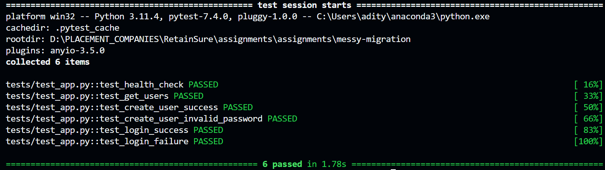

# <b>Major Issues Identified</b>

## Poor Code Organization
<li>All logic (routes, DB operations, validation) was mixed inside a single `app.py`.</li>
<li>No separation of concerns, making the code hard to read, debug, or extend.</li>
<li>No modular structure, making testing,scaling and maintenance difficult.</li>

## Security Vulnerabilities
<li><b>SQL Injection:</b> Queries were constructed with f-strings (Unsafe string formatting in SQL queries) (e.g., `f"SELECT * FROM users WHERE id = '{user_id}'"`).</li>
<li><b>Plaintext Passwords:</b> User passwords were stored in the database without hashing or encryption.</li>
<li><b>Lack of Input Validation:</b> No checks for email format, password strength, or duplicate emails.</li>

## Lack of Best Practices / Formatting
<li><b>Global and Hard-coded Database Connection:</b> The database connection (`conn`) and cursor were created once and reused unsafely across all requests, leading to potential concurrency issues.</li>
<li><b>Inconsistent Response Format:</b> Raw strings returned instead of JSON objects, which is not API-friendly.</li>
<li><b>The original endpoints returned str(users) or plain strings like "User created" instead of using jsonify().
This means the responses didn't have Content-Type: application/json, which is not API best practice.</li>
<li>No proper HTTP status codes (200 always returned, even for errors).</li>

## Error Handling
<li>No `try-except` blocks for database operations — exceptions caused raw 500 errors.</li>
<li>Generic error messages were returned, giving no useful context to clients.</li>
<li>No handling of edge cases, like empty requests or invalid formats or invalid JSON payloads.</li>

## Database & Query Issues
<li><b>Row Count Detection Issues:</b> No reliable way(repsonse messages) to check if `UPDATE`/`DELETE` affected rows using cursor.execute in SQLITE3.</li>
<li><b>Repeated Code:</b> Same DB operations repeated across routes.</li>
<li><b>No Transactions:</b> Rollback was not considered on query failures.</li>

## Testing and Validation
<li>No test suite (e.g., `pytest`), so there was no way to confirm that the API worked as expected.</li>
<li>No validation on `POST /users` or `PUT /user/<id>` for missing/invalid fields.</li>
<li>No password strength enforcement.</li>

## Other Issues
<li><b>Debugging Prints in Production:</b> `print()` statements used for logging. We can use Logging and store in future enhancements</li>

# <b>Changes Made</b>

## Code Organization

### Split code into modular files:

<li>routes.py – Handles API endpoints only with Error Handling and Validation and Formatted rendering.</li>

<li>services.py – Contains core logic and database calls.</li>

<li>db.py – Provides reusable functions (fetch_one, fetch_all, execute_query) and safe DB connection management.</li>

<li>utils.py – For password hashing, input validation, and helper functions.</li>

<li>init_db.py – Initializes the database with hashed sample passwords.</li>

#### Introduced a create_app() factory function for clean Flask app creation (app/__init__.py).

## Code Quality Improvements
<li>Improved code readability with meaningful variable/function names.</li>
<li>Refactored repetitive DB,Utils etc. logic into reusable helper functions.</li>

## Security Improvements

<li>Parameterized SQL queries to eliminate SQL injection risks.</li>

<li>Password Hashing with werkzeug.security (bcrypt-based).</li>

<li>Validation for email format (via regex).</li>

<li>Password rules: minimum 6 characters, must include both letters and numbers.</li>

<li>Duplicate email check to prevent duplicate users.</li>

## API Best Practices

<li>Standardized JSON responses (instead of raw strings).</li>

<li>Implemented HTTP status codes (201 for creation, 400 for invalid data, 404 for not found, 401 for failed login).</li>
<li>Improved response messages for better clarity (e.g., when user creation or deletion is successful or fails) and custom response body for Login success </li>

<li>Home route (/) now provides a JSON health check response.</li>

## Error Handling

<li>Added try-except blocks around critical operations.</li>

<li>Descriptive error messages returned in JSON format.</li>

## Database Improvements

<li>Removed global cursor and conn objects.</li>
<li>Added a context manager for DB connections (get_cursor()).</li>
<li>execute_query() now uses SELECT changes(); to accurately detect rows updated or deleted.</li>

## Tests Module ->

To ensure critical functionality is working as expected, a minimal `tests/test_app.py` was added with pytest.
Tests were designed to validate both success and failure scenarios for key endpoints.

#### Key Tests Implemented:
<li>GET / – Status check.</li>
<li>GET /users – Fetch all users.</li>
<li>POST /users – Create user (valid and invalid cases).</li>
<li>POST /login – Login with correct and incorrect credentials.</li>
<li>DELETE /user/<id> – Delete user.</li>

SO They validate both success and failure scenarios to ensure API stability.  
All tests passed successfully using:
`pytest -v`

Tests run in my terminal:

## Trade-Offs/Avoiding OverEngineering Away from Simplicity
<li>No authentication tokens (JWT) implemented, as it was outside the scope.</li>

<li>No database connection pooling (SQLite is lightweight and in-memory for this assignment).</li>

<li>No emphasized on UI/Frontend</li>

<li>Focused only on critical tests (not full test coverage).</li>

# Future Improvements (Given More Time)
<li>Add pytest test cases for critical endpoints.</li>

<li>Implement JWT-based authentication for login sessions.</li>

<li>Add pagination for /users endpoint if the user base grows.</li>

<li>Introduce structured logging (e.g., logging module) instead of just Print.</li>

<li>Use environment-based config files (config.py) for DB paths and secrets.</li>

<li>Structured routes and services to be easily extended for future features like forget password, monitoring etc.</li>

# AI Usage

- Tools Used:** ChatGPT (OpenAI) for reference and technical guidance.  
- <b>Code Contribution:</b>  
  <li> Drafted `tests/test_app.py` for critical endpoint testing.</li>
  <li> Suggested **regex patterns** for email and password validation and that part of utils.py.  </li>
  <li> Recommended the `SELECT changes();` fix in `execute_query()` to ensure accurate row modification detection in SQLite when there was response mismatch during put/delete apis testing. </li>
- <b>Documentation Support:</b>  
  <li> Assisted in formatting and enhancing this CHANGES.md file quickly.  </li>
  <li> Helped organize points for more future improvements potentials and API testing strategies as part of test_app.py and helped me resolve the correct working by adding system path appropriately.</li>  
- <b>Role of AI:</b>  
  <li> Provided **security and best practice recommendations** like appropriate proper status codes.</li>
